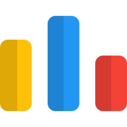

<h1 align="left">Hi 👋, I'm Mohamed Radwan</h1>

  

## 👨🏻‍💻 About Me 
- 🔭 &nbsp; I’m currently a Freelancer Full Stack Developer.
- 🤔 &nbsp; Exploring new technologies for development.
- 🎓 &nbsp; Studying Full-Stack Web development technologies.
- 🌱 &nbsp; Enthusiast in Web development .

### :mortar_board: Graduated:
Computer Science, Thebes Academy 2020

<h3 align="left">🤝🏻 Connect with Me</h3>

    
    
    
    
      

    

## 🛠 Tech Stack
- 💻 &nbsp; C | C++ | Java | Python | PHP
- 💻 &nbsp; JavaScript | NodeJS | JQuery | React
- 🌐 &nbsp; HTML5 | CSS3 | Bootstrap | Tailwind CSS | SASS
- 🛢 &nbsp; MySQL | MongoDB | SQL Server
- 🔧 &nbsp; Git | Visual Studio code | NetBeans | xammp | Eclipse | Anaconda | VM Ware

## 📖 I also learned about</h4>
- Data Structure & Algorithms
- Operating System
- OOP & Design Pattern
- Linux Fundamentals
- Networks Fundamentals

&nbsp;

  
